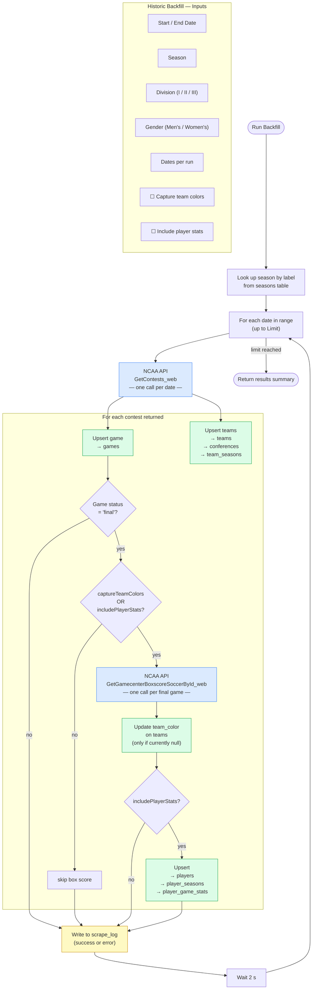
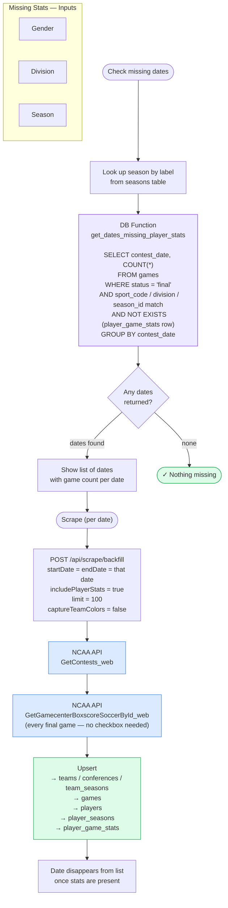

# Scraper Flow Diagrams

## Historic Backfill

### Checkbox impact summary

| Checkbox state | NCAA API calls | DB tables written |
|---|---|---|
| Neither checked | `GetContests_web` only | `teams`, `conferences`, `team_seasons`, `games`, `scrape_log` |
| Capture team colors only | + `GetGamecenterBoxscoreSoccerById_web` per final game | + `teams.team_color` (skipped if already set) |
| Include player stats only | + `GetGamecenterBoxscoreSoccerById_web` per final game | + `players`, `player_seasons`, `player_game_stats` |
| Both checked | + `GetGamecenterBoxscoreSoccerById_web` per final game | + `teams.team_color`, `players`, `player_seasons`, `player_game_stats` |

---

## Missing Stats

> The "Scrape" button per date is equivalent to running Historic Backfill on that single date with **Include Player Stats** checked and **Capture Team Colors** off.
